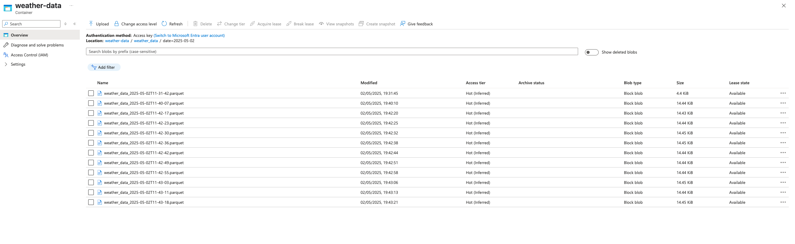

# 📄 DigiHaul Data Engineer Take-Home Assignment - Aliff Danial

## 📝 Overview

This project extracts hourly weather data for 10 coordinates using the OpenWeather API, stores the data in Azure Blob Storage in Parquet format, and is scheduled via Apache Airflow.

---

## 📌 Requirements

- Docker Installed
- Microsoft Azure Account

---

## 🚀 Airflow Setup With Docker

1. Download docker compose file using wget from official airflow website. In this project I am using Airflow `2.10.4`
    
    ```bash
    wget https://airflow.apache.org/docs/apache-airflow/2.10.4/docker-compose.yaml 
    ```
    
2. Some changes I made to the `docker-compose` file:
    1. I changed the PostgreSQL 13 → 16. Since PostgreSQL 13 will reached its end-of-life at the end of 2025. Also, PostgreSQL 16 has better performance.
    2. I set `AIRFLOW__CORE__LOAD_EXAMPLES` to `false`  to avoid loading the sample dags.
3. Create directories for `dags` , `logs` , `plugins`  and `config` 
    
    ```bash
    mkdir -p ./dags ./logs ./plugins ./config
    ```
    
4. Prepare the environment variable files as follows to ensure Airflow able to connect to Azure KeyVault.
    1. Docker user needs a consistent user id for avoiding the permission issue hence we are create .env with userid of current user
        
        ```bash
        echo -e "AIRFLOW_UID=$(id -u)" > .env
        ```
        
    2. Final `.env` file should look like this
        
        ```bash
        # .env
        # Set to the user ID of the airflow user
        AIRFLOW_UID=userid
        _AIRFLOW_WWW_USER_USERNAME=admin # optional
        _AIRFLOW_WWW_USER_PASSWORD=admin # optional
        
        # Azure credentials for accessing Key Vault
        AZURE_TENANT_ID=tenant_id
        AZURE_CLIENT_ID=client_id
        AZURE_CLIENT_SECRET=secret
        
        # Key Vault name
        AZURE_KEYVAULT_URL=keyvault_url
        
        # Secret Backend Kwargs
        AIRFLOW__SECRETS__BACKEND_KWARGS={"connections_prefix": "airflow-connections", "variables_prefix": "", "vault_url": "<key-vault-url>"}
        ```
        
5. To extend the configuration of Airflow to change the secrets backend to use Azure Key Vault backend, we need to create `docker-compose.override.yml` file. This file will extend the configuration for each service.
    1. When we change the secrets backend to use Azure KeyVault, somehow `Airflow Logging` settings is changed to Remote Logging
    2. So we need to explicitly change the `Remote Logging` Settings to `False`
    
    ```yaml
    services:
      airflow-webserver:
        environment:
          AIRFLOW__SECRETS__BACKEND: airflow.providers.microsoft.azure.secrets.key_vault.AzureKeyVaultBackend
          AIRFLOW__SECRETS__BACKEND_KWARGS: ${AIRFLOW__SECRETS__BACKEND_KWARGS}
          AIRFLOW__LOGGING__REMOTE_LOGGING: "False"
          AIRFLOW__LOGGING__REMOTE_BASE_LOG_FOLDER: ""
          AZURE_CLIENT_ID: ${AZURE_CLIENT_ID}
          AZURE_CLIENT_SECRET: ${AZURE_CLIENT_SECRET}
          AZURE_TENANT_ID: ${AZURE_TENANT_ID}
    
      airflow-scheduler:
        environment:
          AIRFLOW__SECRETS__BACKEND: airflow.providers.microsoft.azure.secrets.key_vault.AzureKeyVaultBackend
          AIRFLOW__SECRETS__BACKEND_KWARGS: ${AIRFLOW__SECRETS__BACKEND_KWARGS}
          AIRFLOW__LOGGING__REMOTE_LOGGING: "False"
          AIRFLOW__LOGGING__REMOTE_BASE_LOG_FOLDER: ""
          AZURE_CLIENT_ID: ${AZURE_CLIENT_ID}
          AZURE_CLIENT_SECRET: ${AZURE_CLIENT_SECRET}
          AZURE_TENANT_ID: ${AZURE_TENANT_ID}
    
      airflow-worker:
        environment:
          AIRFLOW__SECRETS__BACKEND: airflow.providers.microsoft.azure.secrets.key_vault.AzureKeyVaultBackend
          AIRFLOW__SECRETS__BACKEND_KWARGS: ${AIRFLOW__SECRETS__BACKEND_KWARGS}
          AIRFLOW__LOGGING__REMOTE_LOGGING: "False"
          AIRFLOW__LOGGING__REMOTE_BASE_LOG_FOLDER: ""
          AZURE_CLIENT_ID: ${AZURE_CLIENT_ID}
          AZURE_CLIENT_SECRET: ${AZURE_CLIENT_SECRET}
          AZURE_TENANT_ID: ${AZURE_TENANT_ID}
    ```
    
6. To initialize all the services
    
    ```bash
    docker compose up airflow-init
    ```
    
7. To run Airflow in the background
    
    ```yaml
    docker compose up -d
    ```
    
8. Now, your Airflow is up and running. 
9. To access to airflow Web UI, go to `localhost:<port number>` 
    1. In current `docker-compose.yaml` file, the `webserver` ports are set to `8080:8080` 
    2. So, to access the Airflow Web UI, we can got to `localhost:8080` 
    3. By default, the username and password should be `airflow` 
    4. But in this example, I have defined the username and password as `admin` in the .env file

---

## 🔐 Secrets & Configuration

Requirements:

- AZ cli installed

### Step 1: **Register an App (Service Principal)**

```bash
az ad sp create-for-rbac --name <app-name> --sdk-auth
```

This will return json object like this:

```json

{
  "clientId": "...",
  "clientSecret": "...",
  "tenantId": "...",
  "subscriptionId": "...",
  ...
}
```

Save these into `.env` file:

- `AZURE_CLIENT_ID`
- `AZURE_CLIENT_SECRET`
- `AZURE_TENANT_ID`

---

### Step 2: **Create Azure Key Vault**

```bash
az keyvault create --name airflow-connection-kv \
        --resource-group <your-resource-group> \
        --location southeastasia \
        --enable-rbac-authorization true
```

📝 Use `--enable-rbac-authorization true` to allow RBAC-based access.

---

### Step 3: **Assign Key Vault Role to the App**

```bash
az role assignment create \
  --assignee <AZURE_CLIENT_ID> \
  --role "Key Vault Secrets Officer" \
  --scope $(az keyvault show --name airflow-connection-kv --query id -o tsv)
```

---

### Step 4: **Assign Key Vault Role to self**

This is to make the current signed-in user have the access to add/update secrets in Azure Key Vault

```bash
az role assignment create \
  --assignee $(az ad signed-in-user show --query id -o tsv) \
  --role "Key Vault Secrets Officer" \
  --scope $(az keyvault show --name airflow-connection-kv --query id -o tsv)
```

### Step 5: **Add secrets to the Key Vault**

```bash
az keyvault secret set --vault-name airflow-connection-kv \
    --name openweather_api_key \
    --value "your_openweather_api_key"
    
az keyvault secret set --vault-name airflow-connection-kv \
    --name azure_blob_conn_str \
    --value "your_azure_blob_storage_connection_string"
```

---

## ⏰ Dag Setup

1. Make sure Airflow is up and running.
2. Place `extract_weather_data_and_upload_to_blob.py` in your Airflow dags folder.
3. Trigger manually or let it run every hour as scheduled.

---

### 🖼️ Screenshots

Parquet Files in Blob Storage



Secrets in Key Vault


---

Example of succesful dag runs


Sample data


### 🔧Troubleshoot

1. Sometime the dag is not showing in the Web UI and the import error is not showing as well. To check what is the error, we can run this command. This command will check if the dags are in the `dagbag` and check if there is any error with any of the dag.
    
    ```bash
    docker compose exec airflow-webserver python -c "
    from airflow.models import DagBag; 
    dagbag = DagBag(dag_folder='/opt/airflow/dags', include_examples=False); 
    print(f'Found {len(dagbag.dags)} DAGs\nDAG IDs: {list(dagbag.dags.keys())}\nErrors: {dagbag.import_errors}')"
    ```
    
    1. If there is no error when running the command above. Try restart the docker with
        
        ```bash
        docker compose down && docker compose up -d
        ```
        
    
2. To ensure if Airflow is able to get Variable for Azure Key Vault. Run this command to test if the Variable exists in Azure Key Vault
    
    ```bash
    docker compose exec airflow-worker python -c "
    from airflow.models import Variable
    print('openweather_api_key:', Variable.get('openweather_api_key'))
    "
    ```